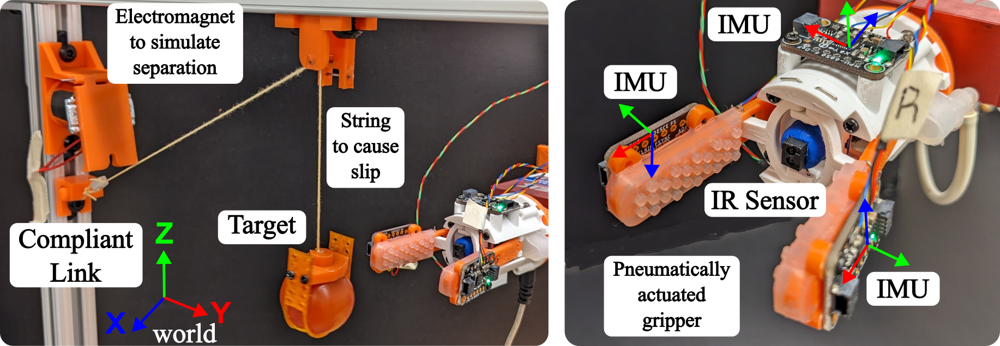

# Grasp State Classification in Agricultural Manipulation
Benjamin Walt (Department of Mechanical Science & Engineering, University of Illinois, Urbana-Champaign, USA)  
Girish Krishnan (Department of Industrial & Enterprise Systems Engineering, University of Illinois, Urbana-Champaign, USA)

## Abstract
The agricultural setting poses additional challenges for robotic manipulation, as fruit is firmly attached to plants and the environment is cluttered and occluded. Therefore, accurate feedback about the grasp state is essential for effective harvesting. This study examines the different states involved in fruit picking by a robot, such as successful grasp, slip, and failed grasp, and develops a learning-based classifier using low-cost, computationally light sensors (IMU and IR reflectance). The Random Forest multi-class classifier accurately determines the current state and along with the sensors can operate in the occluded environment of a plant. The classifier was successfully trained and tested in the lab and showed 100% success at identifying slip and grasp failure and 80% success identifying successful picks on a real cherry tomato plant. By using this classifier, corrective actions can be planned based on the current state, thus leading to more efficient fruit harvesting.

## What is Grasp State?
<!--  -->

Grasp State changes during the grasping process.  It starts with closing the gripper and ends in either a _Successful Grasp_ or _Failed Grasp_ state. It will passthough the _Slip_ or _No Slip_ states - possibly several times.  To get to a _Successful Grasp_ it must experience a _Separation Event_.

## Hardware

### Sensors
Three Inertial Measurement Units (IMU) and one IR reflectance sensor were attached to a two finger, pneumatically actuated gripper.  This data was collected at 150Hz.
### Training Rig
To simulate tomato picking in the lab, a training rig was created.  To simulate attachment, the tomato was attached to a string.  When fixed in place, this allowed us to induce slip.  A electromagnet actuated quick release mechanism was used to simulate separation.  Picking was performed with a 6 DOF arm (xArm6, [UFACTORY](https://www.ufactory.cc/)).
## Pipeline

To perform the classification, a Random Forest Classifier was use.  The IMU data (Linear and Rotational acceleration for each axis) is passed through a Fast Fourier Transform (FFT) using a 25 sample window.  This data along with the IR sensor data (A single value giving a sense of presence) is passed to the Random Forest Classifier which outputs the classification.

## Training
Insert LInk to Video  

## Testing

## Results
Insert Results data Picture  
Which ones???  

## Conclusion
This work shows promising results for grasp state classification, but it lacks robustness.  More work is needed to address the weaknesses in differentiating between similar states and dealing with rotational slip.  It is necessary to make use of these classfications within a harvesting pipeline to take action and improve efficiency.
